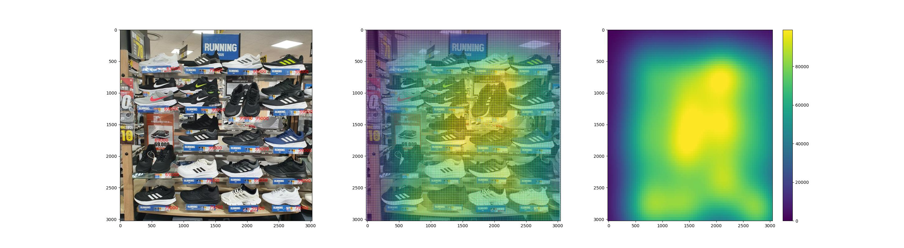

## Price Distribution
Picture the merchandise stand with smartphone camera and visualize it's price distrubution. 
Developed to instantly visualize if a stand is well displayed via prices. 
Developed for merchandise displaying personnel.
 - ex) Is profit-purposed product well displayed on the line of sight?
 - ex) Is lesser-product displayed on the outward?
 - ex) Are prices giving customer at least three choices? (Good, Better, Best)
 

### Example Results

  

## Usages
Change "UPPER_LIMIT"(ex. UPPER_LIMIT = 150000) depanding on the price of your image.
  

"Google GCP Vision API"
 - JSON key required. (https://cloud.google.com/vision/docs/before-you-begin)
 - pip install numpy pandas matplotlib opencv-python scipy
 - pip install --upgrade google-cloud google-cloud-vision
 - Limit the image to 75 megapixels.
  
